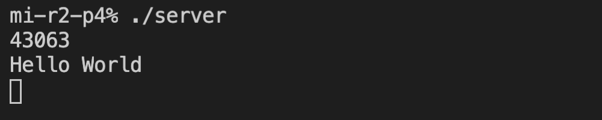
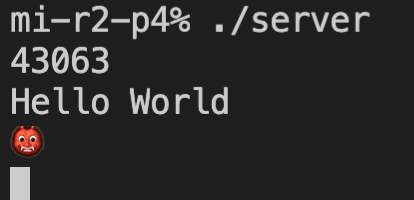

# minitalk

#### The goal of this project is to create two executables: a server and a client.

#### - The client will send information (a string) to the server using UNIX signals.

#### - The server must correctly receive and interpret this information, then display it.

#### The Makefile is used to easily compile the server and the client executables

### Behaviour:

1) By running the server executable we start up the server and it displays its process id:

2) By running the client with the process id from the server we can send strings to the server

3) Server receives bits containing the information, translates them to characters and prints the result as a string:

#### Additional behaviour:
1) The client can also send Unicode format characters

2) The server interprets and displays them correctly  

